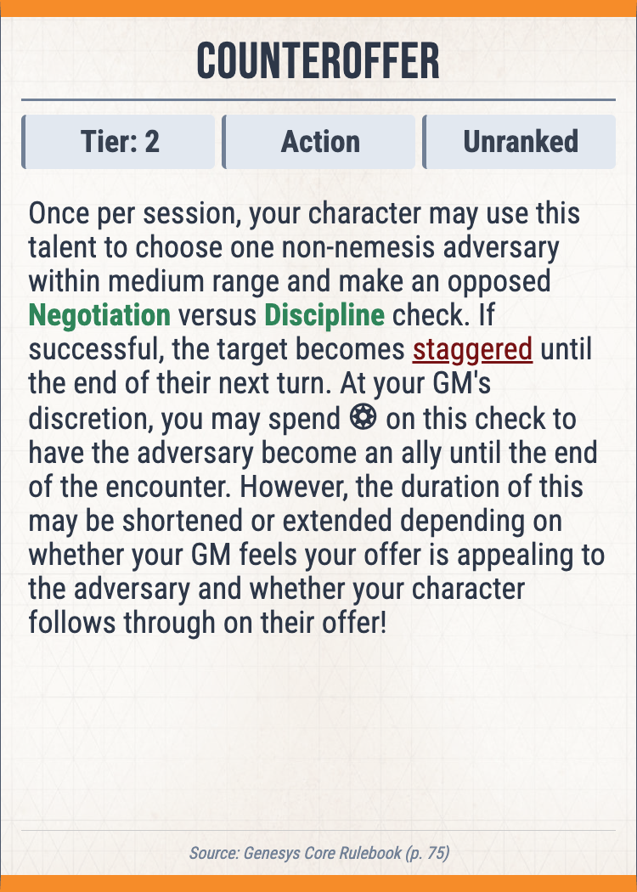
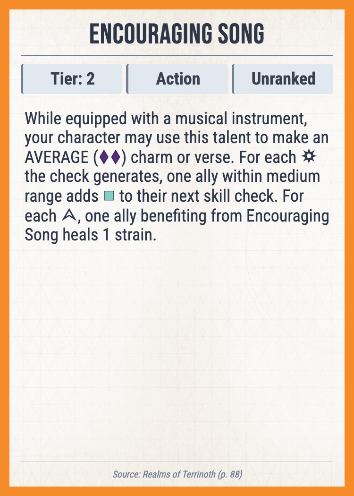
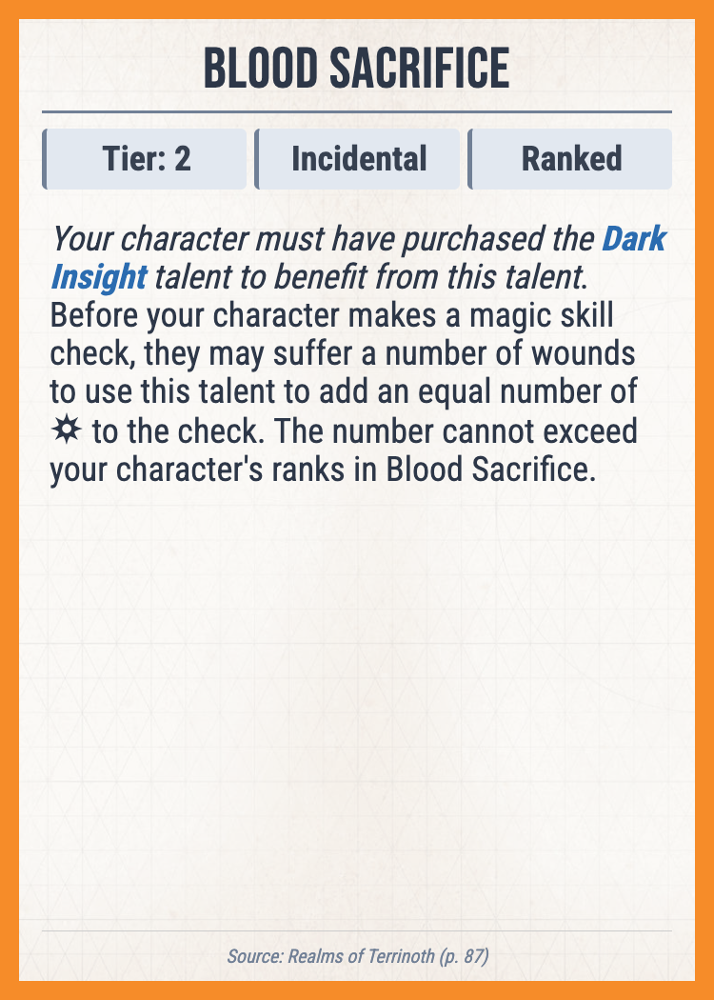

# Genesys Talent Card Generator

This project is a command-line tool that automatically generates high-quality talent cards for the Genesys Roleplaying Game. It reads talent data from a JSON file that follows the community-standard schema from **Genesys Ref** and uses an HTML template to render a PNG image for each talent, ready for printing.

The primary goal is to provide a simple and fast way to create physical assets for your game sessions without manual design work.

## Features

* **Automated Card Generation**: Run a single command to generate cards for every talent in a sourcebook.
* **High-Quality PNG Output**: Creates crisp, print-ready PNG images suitable for physical cards.
* **Customizable Templates**: The look and feel of the cards can be changed by editing a single HTML and CSS file.
* **Advanced Tag Parsing**: Accurately renders Genesys-specific formatting, including dice symbols.

## Sample Cards

Here's are some example cards generated by this tool:

| Counteroffer                     | Encouraging Song                     | Distinctive Style                     | Blood Sacrifice                     |
|----------------------------------|--------------------------------------|---------------------------------------|---------------------------------------|
|  |  |  |  |

## Getting Started

### Prerequisites

* **Go**: Version 1.18 or later must be installed.
* **Google Chrome**: The tool uses Chrome in headless mode to render the HTML. Google Chrome must be installed.
* **A Genesys Data File**: A `.json` file containing game data. You should own the content contained in the json file (see https://genesysref.netlify.app/disclaimer)
### Installation & Running

1.  **Clone the repository:**
    ```bash
    git clone <your-repo-url>
    cd <your-repo-name>
    ```

2.  **Run the generator:**
    The program takes two command-line arguments: the path to your sourcebook `.json` file and the desired output directory.

    ```bash
    go run main.go /path/to/your/sourcebook.json ./output-directory
    ```

    For example:
    ```bash
    go run main.go "./data/core-rulebook.json" "./cards"
    ```

3.  The generated PNG files will be saved in the output directory.

## How It Works

For those interested in the technical workflow, here is the high-level process:

1.  **Load Data**: The program starts by loading and parsing the talent data from the sourcebook `.json` file into Go structs.
2.  **Process Tags**: It then iterates through each talent's description, parsing the special Genesys tags (like `{@dice}` or `{@skill}`) into the appropriate HTML. It uses an "inside-out" parsing strategy to correctly handle nested tags.
3.  **Inject into Template**: The processed data for each talent is injected into a customizable HTML template.
4.  **Render and Screenshot**: Finally, it uses a headless Chrome browser to render the final HTML for each card, takes a screenshot of the card element, and saves it as a high-quality PNG file.

## Technologies Used

* **Go**: The core application logic.
* **`chromedp`**: A Go library for controlling a headless Chrome browser.
* **HTML & CSS**: For templating the cards.
* **Tailwind CSS**: Used in the template for rapid UI development.

## Contributing

This project can be expanded. Feel free to fork the repository, make improvements, and submit a pull request. Bug reports and feature requests are welcome. Potential ideas include:

* Support for other card types (adversaries, items, etc.).
* Additional card templates.

## Acknowledgements

* The JSON schema used is created by [Genesys Ref](https://genesysref.netlify.app/api/homebrew-helper/getting-started).
* The card background image is from [c-bec-k/GenesysRPG](https://github.com/c-bec-k/GenesysRPG).
* The Genesys dice and symbol font is a fork from [themensch/FFG-Genesys-Glyphs-and-Dice](https://github.com/themensch/FFG-Genesys-Glyphs-and-Dice).
